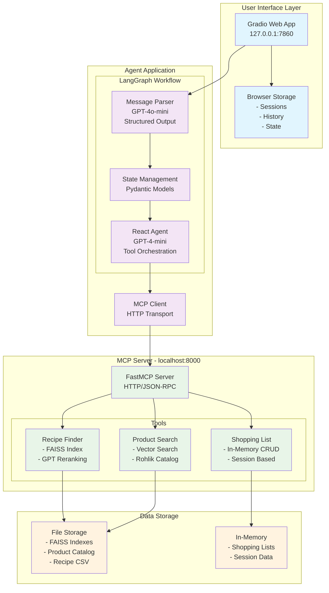

# Rohlik Test Case - AI Meal Planning Assistant

This project is a response to the Rohlik test case, implementing an AI-powered meal planning assistant with integrated shopping list functionality. The system consists of two main components: an intelligent agent built with LangGraph and an MCP (Model Context Protocol) server providing specialized tools.

## 🏗️ Project Architecture

The project is structured into two main sub-projects:

### 1. **Agent** (`/agent`)
- **Framework**: LangGraph (chosen for its robust workflow management capabilities)
- **Features**:
  - Conversational meal planning with memory persistence
  - Intelligent parsing of user requests (dietary preferences, planning duration)
  - Simple Gradio web interface for easy interaction
  - Session management with browser storage
  - Follow-up question generation

### 2. **MCP Server** (`/mcp-server`)
- **Purpose**: Provides three specialized tools for meal planning
- **Tools**:
  1. **Recipe Finder**: Semantic search through provided recipe dataset
  2. **Rohlik Product Search**: Vector search through scraped Rohlik.cz products with GPT-4 reranking
  3. **Shopping List Manager**: Add, remove, and manage shopping list items

## 🏛️ System Design

### Architecture Overview

The system follows a **microservices architecture** with clear separation of concerns:

```
┌─────────────────────────────────────────────────────────────┐
│                    USER INTERFACE                           │
│                  Gradio Web App                             │
│                (127.0.0.1:7860)                            │
└─────────────────────┬───────────────────────────────────────┘
                      │ HTTP Requests
┌─────────────────────▼───────────────────────────────────────┐
│                 AGENT APPLICATION                           │
│  ┌─────────────────────────────────────────────────────┐   │
│  │              LangGraph Workflow                     │   │
│  │  ┌─────────────────┐  ┌─────────────────────────┐   │   │
│  │  │ Message Parser  │  │    Assistant Node       │   │   │
│  │  │ (GPT-4o-mini)   │  │   (React Agent)         │   │   │
│  │  │ Structured      │  │   - Tool Selection      │   │   │
│  │  │ Output          │  │   - Conversation Flow   │   │   │
│  │  └─────────────────┘  └─────────────────────────┘   │   │
│  └─────────────────────────────────────────────────────┘   │
│                          │                                 │
│                          │ MCP Client                      │
│                          │ (HTTP Transport)                │
└──────────────────────────┼─────────────────────────────────┘
                           │
┌──────────────────────────▼─────────────────────────────────┐
│                  MCP SERVER                                │
│                (localhost:8000)                            │
│  ┌───────────────┐ ┌──────────────┐ ┌──────────────────┐  │
│  │ Recipe Finder │ │ Product      │ │ Shopping List    │  │
│  │ - FAISS Index │ │ Search       │ │ Manager          │  │
│  │ - GPT Rerank  │ │ - FAISS      │ │ - In-Memory      │  │
│  │               │ │ - Embeddings │ │ - CRUD Ops       │  │
│  └───────────────┘ └──────────────┘ └──────────────────┘  │
└────────────────────────────────────────────────────────────┘
```

### System Architecture Diagram



### Component Breakdown

#### 1. **Agent Application** (`/agent`)
- **Framework**: LangGraph for workflow orchestration
- **Core Components**:
  - **Message Parser**: GPT-4o-mini with structured JSON output for extracting dietary preferences and planning duration
  - **React Agent**: GPT-4-mini with tool-calling capabilities and conversation management
  - **State Management**: Pydantic models for type-safe state handling
  - **MCP Client**: HTTP-based communication with tool server

#### 2. **MCP Server** (`/mcp-server`)
- **Framework**: FastMCP for tool serving
- **Transport**: HTTP with streamable responses
- **Tool Architecture**: Modular design with three specialized tools

#### 3. **User Interface**
- **Framework**: Gradio for rapid web UI development
- **Features**: Multi-tab conversations, follow-up questions, real-time streaming
- **Storage**: Browser-based session persistence (no server-side database)

### Data Flow Architecture

```
User Input → Message Parser → State Extraction → React Agent → Tool Selection → MCP Tools → Results → Response Generation → UI Update
```

#### Detailed Flow:
1. **Input Processing**: User message received via Gradio interface
2. **Intent Analysis**: GPT-4o-mini extracts structured data (dietary goals, days)
3. **State Management**: LangGraph maintains conversation context and extracted parameters
4. **Tool Orchestration**: React Agent decides which tools to call and in what sequence
5. **MCP Communication**: HTTP requests to localhost:8000/mcp endpoint
6. **Result Processing**: Tool outputs processed and integrated into conversation
7. **Response Generation**: Final meal plan and shopping list formatted for user

### Storage & Persistence Strategy

#### **No Traditional Database**
- **Rationale**: Simplified architecture for demonstration purposes
- **Trade-offs**: No persistence across app restarts (acceptable for test case)

#### **Storage Locations**:
1. **Gradio Browser Storage**: 
   - Conversation history
   - Session state
   - Multi-tab data
   - User preferences

2. **In-Memory Storage** (MCP Server):
   - Shopping lists during session
   - Active recipe selections
   - Temporary state

3. **File-Based Storage**:
   - Pre-built FAISS indexes
   - Product catalog (JSON/Pickle)
   - Recipe dataset (CSV)

### Communication Architecture

#### **Agent ↔ MCP Server**
- **Protocol**: Model Context Protocol (MCP)
- **Transport**: HTTP with streamable responses
- **Endpoint**: `http://localhost:8000/mcp`
- **Format**: JSON-RPC style tool calls

#### **User ↔ Agent**
- **Interface**: Gradio web components
- **Streaming**: Real-time response updates
- **State**: Browser-based persistence with encryption

### Scalability Considerations

#### **Current Design** (Test Case):
- Single-process applications
- In-memory storage
- Local HTTP communication

#### **Production Adaptations**:
- **Database Integration**: PostgreSQL/MongoDB for persistence
- **Containerization**: Docker for deployment
- **Load Balancing**: Multiple MCP server instances
- **Caching**: Redis for frequently accessed data
- **Authentication**: User management system

## 🛠️ Technical Implementation

### Recipe Finder
- Uses vector search on the provided recipe dataset
- Implements semantic retrieval with FAISS indexing
- GPT-4 reranking for improved result quality

### Rohlik Product Search
- Complete product catalog! I  scraped from Rohlik.cz website =)
- FAISS vector indexing for fast semantic search
- GPT-4 reranking to filter and return most relevant products
- Pre-built indexes included (no need to re-index)

### Shopping List Manager
- Mimics Rohlik app functionality
- In-memory storage with full CRUD operations
- Supports multiple shopping lists with unique identifiers

### Agent Intelligence
- LangGraph workflow for understanding user intent
- Structured parsing of dietary preferences and planning duration
- Memory persistence within LangGraph implementation
- Integration with all MCP tools

## 📁 Project Structure

```
RohlikTestCase/
├── agent/                    # LangGraph-based meal planning agent
│   ├── app.py               # Main Gradio application
│   ├── graph.py             # LangGraph workflow definition
│   ├── prompts.py           # System prompts and templates
│   ├── run.py               # Application runner
│   └── pyproject.toml       # Dependencies and configuration
└── mcp-server/              # MCP server with meal planning tools
    ├── mcp_server.py        # Main MCP server
    ├── tools/               # Tool implementations
    │   ├── recipe_finder.py
    │   ├── rohlik_product_search.py
    │   ├── shopping_list.py
    │   └── rohlik_data/     # Pre-built indexes and product data
    ├── recipes.csv          # Recipe dataset
    └── pyproject.toml       # Dependencies and configuration
```

## 🚀 Quick Start

### Prerequisites
- Python 3.11+
- [uv](https://docs.astral.sh/uv/) package manager
- OpenAI API key

### Environment Setup

1. **Create environment files** in both `agent/` and `mcp-server/` directories:

```bash
# agent/.env
OPENAI_API_KEY=your_openai_api_key_here

# mcp-server/.env  
OPENAI_API_KEY=your_openai_api_key_here
```

### Installation & Launch

The project uses `uv` for dependency management. Follow these steps:

#### Terminal 1: Start MCP Server
```bash
cd mcp-server
uv sync
uv run python mcp_server.py
```

#### Terminal 2: Start Agent
```bash
cd agent
uv sync
uv run python app.py
```

### Access the Application

Once both services are running:
- Open your browser and navigate to: **http://127.0.0.1:7860**
- Start chatting with the meal planning assistant!

## 💬 Usage Examples

Try these example requests:

- *"I need vegetarian meals for 3 days"*
- *"Plan low-carb meals for the week"*  
- *"Help me with high-protein meals for 5 days"*
- *"Create a Mediterranean diet plan for 4 days"*

The agent will:
1. Parse your dietary preferences and duration
2. Search for appropriate recipes
3. Find matching products on Rohlik.cz
4. Create a comprehensive shopping list
5. Engage in follow-up conversations for refinements

## 🔧 Technical Features

### Pre-built Data
- **Embedded indexes**: No need to rebuild FAISS indexes
- **Complete product catalog**: All Rohlik.cz products pre-indexed
- **Recipe dataset**: Ready-to-use recipe collection

### Memory Management
- Persistent conversation memory via LangGraph
- Browser-based session storage
- Multi-tab conversation support

### Search Technology
- **FAISS vector indexing** for fast similarity search
- **OpenAI embeddings** for semantic understanding
- **GPT-4 reranking** for result quality optimization

## 🧪 Testing & Development

### MCP Tools Testing

The MCP server tools can be thoroughly tested both individually and as a complete system:

#### Automated Test Suite
Both projects include comprehensive test suites:

```bash
# Test all MCP server tools
cd mcp-server
uv run pytest tests/ -v

# Test individual components
uv run pytest tests/test_recipe_finder.py -v
uv run pytest tests/test_rohlik_product_search.py -v
uv run pytest tests/test_shopping_list.py -v
```

#### Manual Tool Testing

You can test MCP tools directly using the MCP server in HTTP mode:

```bash
# Start MCP server in HTTP mode for testing
cd mcp-server
uv run python mcp_server.py --http
```

This starts the server on `http://localhost:8000/mcp` where you can:
- Send direct HTTP requests to test tool functionality
- Use MCP client tools to interact with the server
- Debug tool responses and behavior

#### Individual Tool Testing Examples

**Recipe Finder:**
```python
# Test recipe search
{
  "dietary_goal": "vegetarian",
  "keywords": ["pasta", "tomato"],
  "max_results": 3
}
```

**Rohlik Product Search:**
```python
# Test product search
{
  "query": "organic milk",
  "max_results": 5
}
```

**Shopping List Manager:**
```python
# Test shopping list operations
{
  "action": "create",
  "list_id": "weekly_shopping"
}

{
  "action": "add",
  "list_id": "weekly_shopping",
  "ingredients": [
    {"name": "milk", "quantity": "1L"},
    {"name": "bread", "quantity": "2 loaves"}
  ]
}
```

#### Integration Testing

Test the complete workflow by running both services and using the Gradio interface:

1. Start MCP server: `cd mcp-server && uv run python mcp_server.py`
2. Start agent: `cd agent && uv run python app.py`
3. Open browser to `http://127.0.0.1:7860`
4. Test complete meal planning workflows

#### Test Data Validation

The test suite validates:
- ✅ Recipe search accuracy and relevance
- ✅ Product search with semantic similarity
- ✅ Shopping list CRUD operations
- ✅ Error handling and edge cases
- ✅ Data format consistency
- ✅ Tool integration with the agent

## 📋 Dependencies

### Agent
- **LangGraph**: Workflow orchestration
- **Gradio**: Web interface
- **LangChain**: LLM integration
- **OpenAI**: Language model access

### MCP Server
- **FastMCP**: MCP server framework
- **FAISS**: Vector similarity search
- **OpenAI**: Embeddings and reranking
- **Pydantic**: Data validation

## 🌟 Key Features

- ✅ **Conversational Interface**: Natural language meal planning
- ✅ **Intelligent Parsing**: Automatic extraction of dietary preferences and duration
- ✅ **Semantic Search**: Advanced recipe and product discovery
- ✅ **Shopping Integration**: Direct Rohlik.cz product recommendations
- ✅ **Memory Persistence**: Maintains context across conversations
- ✅ **Multi-session Support**: Handle multiple planning sessions
- ✅ **Pre-built Indexes**: Ready to use without data preparation

---

**Note**: This implementation showcases modern AI application architecture with specialized tool integration, semantic search capabilities, and conversational AI workflows suitable for production meal planning applications.
